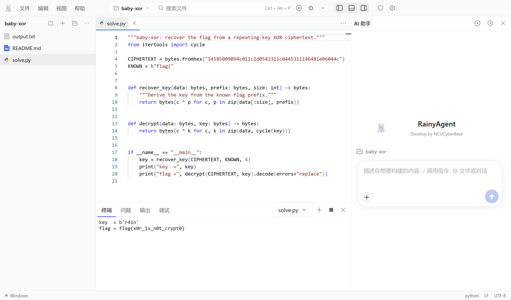

# RainyAgent

English | [中文](README.zh.md)

RainyAgent is a Windows desktop coding agent with a code editor, AI conversations, project memory, and a workspace for tools operated by people. The core installer includes the Windows Host and a complete Strata runtime; users supply their own supported model weights. Commands run in native Windows or a selected WSL2 environment, and other local servers or APIs remain available.

Develop by NCUCyberBase.



## What it includes

- A Monaco editor with file tabs, search, differences, recovery of unsaved work, and sending selected code to AI.
- Project terminals, run configurations, and debugging for Python, JavaScript/TypeScript, and C/C++; PHP supports execution.
- Bundled Strata and Python, model discovery, explicit context budgets, request diagnostics, and project memory with separate use and generation controls.
- Optional offline runtimes and a catalog of 38 tools for manual use, separate from the Agent's default tools.
- Stable release checks and background downloads, with installation only after confirmation and saved shutdown.

<a id="run"></a>
## Download and start

Get [RainyAgent 1.0.1 for Windows x64](https://github.com/RainyMarks/RainyAgent/releases/download/v1.0.1/RainyAgent-1.0.1-windows-x64-setup.exe). The [release page](https://github.com/RainyMarks/RainyAgent/releases/tag/v1.0.1) provides the installer and automatic-update files; optional offline inputs remain in the [resource archive](https://github.com/RainyMarks/RainyAgent/releases/tag/v1.0.0-resources).

Install the core application, open RainyAgent from the desktop shortcut, then choose **File → Open folder**. A new installation uses Windows directly; WSL2 and offline environment components are optional. No activation code is required. The core EXE already supplies the Windows Host, Strata engine, Python, and their runtime dependencies; main and MTP model weights remain outside the installer.

Open **CTF tools → Common tools → Download all tools** while online. Installed tools remain available offline; the catalog checks for added or updated tools. See [tool installation and updates](apps/rainy-desktop/README.md#ctf-workbench).

Automatic updates replace the core application. They do not download optional tool packs, WSL media, or scientific runtimes again. A downloaded update offers **Later** or **Restart and install**; ordinary exit does not install it.

## Connect a model

### Bundled Strata

The core includes [Niko1221/Strata 0.1.39](https://github.com/Niko1221/Strata/releases/tag/v0.1.39) and Python 3.12.14. Its inference engine targets Windows x64 and NVIDIA CUDA 13, requires driver 580 or newer, and includes GPU targets `sm75`, `sm86`, `sm89`, and `sm120`. The package does not provide AMD or Linux inference. Supply a supported Qwen3.8 Flash Next main GGUF, all of its shards, and matching MTP weights as a GGUF or prepared runtime directory; weights and derived dense/expert packs are not bundled.

1. Open **Settings → Models and context → Strata local model**. Choose the main model and matching MTP files, or import a compatible Strata profile. An empty MTP path requests automatic detection beside the model.
2. Save the context window and local port, then select **Start local model**. The first explicit start prepares required model files locally without downloads; preparation and startup can be cancelled.
3. When the model is ready, select **Connect and use by default**. The current Host verifies its actual model and context before selecting it. Reasoning and request output limits remain in the ordinary model settings below.

RainyAgent stops only the processes it started. If a WSL Host under NAT cannot reach the Windows loopback server, select the Windows execution target for Strata. See the [desktop guide](apps/rainy-desktop/README.md#strata-local-inference) for resource controls and the current validation scope.

### Existing server or API

1. Open **Settings → Models and context** and enter a provider ID, service Base URL, protocol, and a key when required.
2. Select **Discover models** or enter the model ID manually. Discovery does not require a model ID or context size.
3. Set the service's actual context window and output limit, save the configuration, then run the streaming and tool-call diagnostic.

The selected Windows or WSL Host must be able to reach the service. RainyAgent keeps credentials in that Host's private credential store and does not silently switch to a cloud model. See the [desktop guide](apps/rainy-desktop/README.md) and [Chinese setup guide](apps/rainy-desktop/README.zh-CN.md) for environments, recovery, and configuration details.

<a id="run-from-source"></a>
## Build from source

Building the Windows release requires Node.js `^22.19 || >=24`, pnpm `11.7.0`, and the Windows/WSL prerequisites in the [build guide](apps/rainy-desktop/README.zh-CN.md#从源码构建). The input manifest restores pinned binaries, including `build-inputs/strata-runtime.tar.gz`, from release assets rather than Git; the bootstrap command restores Strata automatically.

```powershell
git clone https://github.com/RainyMarks/RainyAgent.git
cd RainyAgent
pnpm install --frozen-lockfile
node apps/rainy-desktop/scripts/bootstrap-release-inputs.mjs --manifest apps/rainy-desktop/toolpacks/build-inputs.v1.json
pnpm run build
powershell.exe -NoProfile -ExecutionPolicy Bypass -File apps/rainy-desktop/scripts/package.ps1 -SkipUpstreamBuild -Distribution Ubuntu -ReuseNativeToolsRelease apps/rainy-desktop/release/offline-1.0.1 -ComponentSource apps/rainy-desktop/release/offline-1.0.1/environment-components
```

Replace `Ubuntu` only when your prepared WSL build distribution has another name. [Validation](apps/rainy-desktop/VALIDATION.md) records the build, installation, and runtime checks completed for each artifact; source instructions alone are not a clean-machine acceptance result.

## License and attribution

RainyAgent is maintained independently of DeepSeek. Its baseline is [DeepSeek Harness 0.1.7-rc.2, commit 477b4f420553e8a52c2fbccc464d7561b239c443](https://github.com/deepseek-ai/deepseek-harness/tree/477b4f420553e8a52c2fbccc464d7561b239c443); retained upstream code and changes to its original package directories remain under [MIT](LICENSE.upstream).

RainyAgent integration code uses the [RainyAgent Source Available License 1.0](LICENSE.RainyAgent). Personal and internal business use, modification, and noncommercial redistribution are permitted without a license fee; sale, paid hosting, and commercial redistribution require separate written permission. This is a source-available project, not an OSI-approved open-source distribution. See [license scope](LICENSE) and [desktop third-party notices](apps/rainy-desktop/THIRD_PARTY_NOTICES.md).

Report problems through [GitHub Issues](https://github.com/RainyMarks/RainyAgent/issues). Developers can start with the [architecture](docs/architecture.md), [development guide](docs/development.md), and [AGENTS.md](AGENTS.md).
