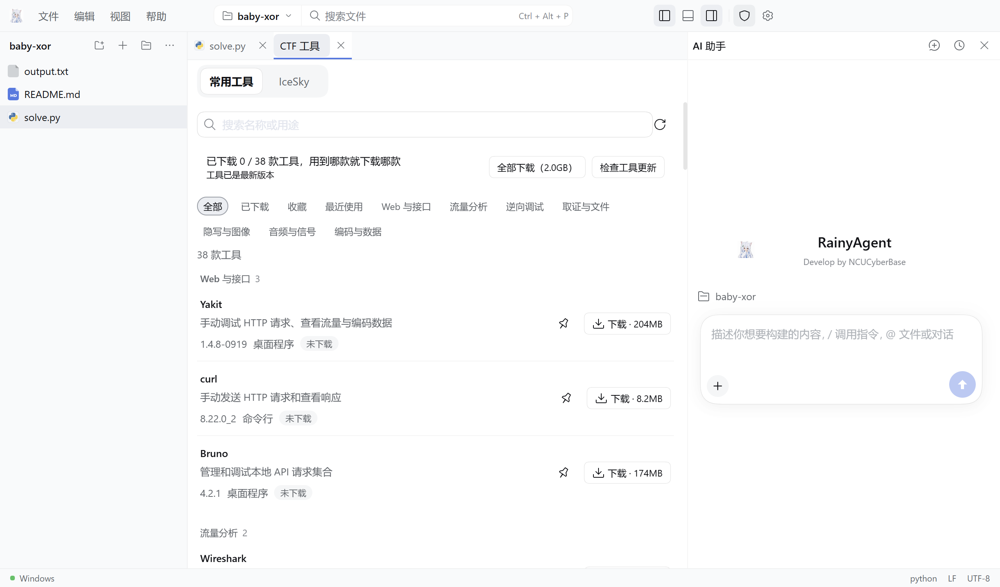

<div align="center">


# RainyAgent

**An AI coding workbench for CTF players on Windows: editor, AI assistant and a 38-tool CTF kit in one window.**

[](https://github.com/RainyMarks/RainyAgent/releases/latest)
[](https://github.com/RainyMarks/RainyAgent/releases)

[](LICENSE)

English | [中文](README.zh.md)

[**Download for Windows**](https://github.com/RainyMarks/RainyAgent/releases/latest) · [Quick start](#run) · [Connect a model](#connect-a-model) · [Build from source](#run-from-source)

</div>


Write a solve script, run it, ask the AI why it fails, then open Wireshark or CyberChef without leaving the window. RainyAgent runs commands in native Windows or WSL2, connects to any compatible model service or API, and can run supported models locally with the Strata engine. Develop by NCUCyberBase.

## Highlights

| | |
|---|---|
| **Light by design** | One package with no plugin framework: an Electron window, a small Node Host and a React page. Tools, the Strata engine, PHP and the WSL runtime are downloaded only when you need them. |
| **AI that works in your project** | The assistant reads and edits project files and runs commands without approval prompts, and remembers the project across conversations. Skills are picked up from `.rainy/skills`; MCP servers (including an IDA preset) and a global prompt are configured in Settings. |
| **A real editor** | A CodeMirror 6 editor with tabs, search and replace, completion, hover, go to definition, rename, diagnostics, diffs and recovery of unsaved work. Run and debug Python, JavaScript/TypeScript and C/C++; run PHP. |
| **38 CTF tools, one click each** | Web, traffic, reverse engineering, forensics, steganography, audio and encoding tools, each downloaded separately. Updates download only the tools that changed. |
| **Windows or WSL2** | Start in native Windows; switch the project to a WSL2 environment whenever a challenge needs Linux. |
| **Your model, your choice** | Use any OpenAI- or Anthropic-compatible service, a local server, or Strata local inference on an NVIDIA GPU. Keys stay on your machine. |



<a id="run"></a>
## Download and start

1. Download [the latest Windows x64 installer](https://github.com/RainyMarks/RainyAgent/releases/latest) and install it. No activation code is required.
2. Open RainyAgent from the desktop shortcut and choose **File → Open folder**.
3. Connect a model in **Settings → Models** (see [Connect a model](#connect-a-model)), then open **AI assistant** on the right.
4. Open **CTF tools → Common tools** and download the tools you need, or select **Download all**. Downloaded tools also work offline.

| Optional download | Size | Where |
|---|---|---|
| Strata engine | about 560 MB | **Settings → Runtime environments → Optional components** |
| PHP | about 38 MB | **Settings → Runtime environments → Optional components** |
| WSL runtime | about 340 MB | Downloaded automatically on the first WSL launch |
| CTF tools | 1 MB – 400 MB each | **CTF tools → Common tools** |

RainyAgent checks for stable releases and downloads them in the background. A downloaded update offers **Later** or **Restart and install**; ordinary exit does not install it, and updates never download your tools again. See [tool installation and updates](docs/desktop.md#ctf-workbench) for details.

### Upgrading from 1.x

RainyAgent 2.0 imports your saved models, API keys and global prompt from 1.x on first start. Chats from 1.x use the old Harness session format and are not imported; per-chat extension settings are replaced by the global MCP settings and automatic skills.

<a id="connect-a-model"></a>
## Connect a model

### Existing server or API

1. Open **Settings → Models** and enter a provider ID, Base URL, protocol, and a key when required.
2. Select **Discover models** or enter the model ID manually.
3. Set the service's actual context window and output limit, save, then run the streaming and tool-call check.

The selected Windows or WSL environment must be able to reach the service. Keys are stored in that environment's private credential store, and RainyAgent never silently switches to another model.

For Claude, select **Load Claude Opus preset** or **Load Claude Haiku preset** and enter your Anthropic API key; both presets share the key. The Haiku preset uses a 100K window so each request stays in Claude Haiku 5.5's lower price tier. A relay works the same way: keep the `anthropic-messages` protocol and the Claude model ID (for example `claude-opus-5-5`, `claude-sonnet-5-5` or `claude-haiku-5-5`), and RainyAgent applies that model's adaptive thinking and effort levels. Claude sessions keep the prompt cache for an hour, so continuing a conversation reads the earlier context from the cache.

### Strata local model

The Strata engine runs [Niko1221/Strata 0.1.39](https://github.com/Niko1221/Strata/releases/tag/v0.1.39) with Python 3.12.14 on Windows x64 with NVIDIA CUDA 13 (driver 580 or newer; GPU targets `sm75`, `sm86`, `sm89`, `sm120`). AMD and Linux inference are not provided. You supply a supported Qwen3.8 Flash Next main GGUF with all of its shards and the matching MTP weights; model weights are not bundled.

1. Open **Settings → Models → Strata local model**. Download the engine first if it is missing, then choose the main model and MTP files or import a Strata profile.
2. Save the context window and local port, then select **Start local model**. Preparation runs locally and can be cancelled.
3. When the model is ready, select **Connect and use by default**.

If a WSL environment under NAT cannot reach the Windows loopback server, use the Windows execution environment for Strata. See the [desktop guide](docs/desktop.md#strata-local-inference) and the [Chinese setup guide](docs/desktop-setup.zh-CN.md) for resource controls and validation scope.

<a id="run-from-source"></a>
## Build from source

Building the Windows release requires Node.js `^22.19 || >=24`, pnpm `11.7.0`, and the Windows/WSL prerequisites in the [build guide](docs/desktop-setup.zh-CN.md#从源码构建). Pinned binaries such as `build-inputs/strata-runtime.tar.gz` are restored from release assets by the bootstrap command rather than stored in Git.

```powershell
git clone https://github.com/RainyMarks/RainyAgent.git
cd RainyAgent
pnpm install --frozen-lockfile
node scripts/bootstrap-release-inputs.mjs --manifest toolpacks/build-inputs.v1.json
powershell.exe -NoProfile -ExecutionPolicy Bypass -File scripts/package.ps1 -Distribution Ubuntu -ReuseNativeToolsRelease release/offline-2.0.0 -ComponentSource release/offline-2.0.0/environment-components
```

Replace `Ubuntu` only when your WSL build distribution has another name. [Validation](docs/validation.md) records the build, installation and runtime checks completed for each release.

For development, `pnpm run dev` builds the app and starts a Host without Electron, then prints a URL you can open in a browser; `pnpm run start` runs Electron on the built files.

## License and attribution

RainyAgent is maintained independently of DeepSeek. Versions 1.x were built on [DeepSeek Harness 0.1.7-rc.2, commit 477b4f420553e8a52c2fbccc464d7561b239c443](https://github.com/deepseek-ai/deepseek-harness/tree/477b4f420553e8a52c2fbccc464d7561b239c443). Version 2.0 replaces that platform with [pi-ai and pi-agent-core](https://www.npmjs.com/package/@earendil-works/pi-ai); the interface primitives and design tokens derived from it remain under [MIT](LICENSE.upstream).

RainyAgent integration code uses the [RainyAgent Source Available License 1.0](LICENSE.RainyAgent). Personal and internal business use, modification, and noncommercial redistribution are free; sale, paid hosting, and commercial redistribution require written permission. This is a source-available project, not an OSI-approved open-source distribution. See [license scope](LICENSE) and [third-party notices](THIRD_PARTY_NOTICES.md).

Report problems through [GitHub Issues](https://github.com/RainyMarks/RainyAgent/issues). Developers can start with the [architecture](docs/architecture.md) and [AGENTS.md](AGENTS.md).
