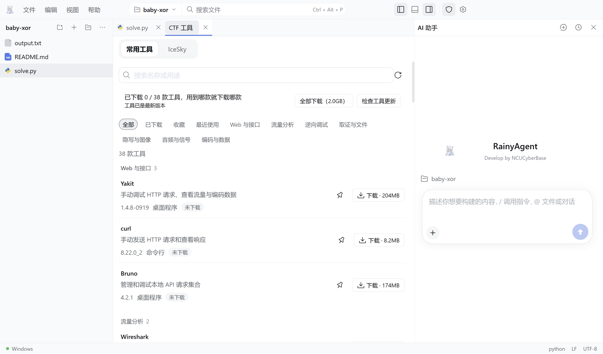

<div align="center">


# RainyAgent

**为 CTF 选手打造的 Windows AI 编程工作台：编辑器、AI 助手和 38 款 CTF 工具，一个窗口全搞定。**

[](https://github.com/RainyMarks/RainyAgent/releases/latest)
[](https://github.com/RainyMarks/RainyAgent/releases)

[](LICENSE)

[English](README.md) | 中文

[**下载 Windows 版**](https://github.com/RainyMarks/RainyAgent/releases/latest) · [快速开始](#run) · [连接模型](#connect-a-model) · [从源码构建](#run-from-source)

</div>


写解题脚本、运行、让 AI 帮你看哪里出错，再顺手打开 Wireshark 或 CyberChef，全程不用离开这个窗口。RainyAgent 可在 Windows 原生或 WSL2 中执行命令，可连接任意兼容的模型服务或 API，也能用 Strata 引擎在本机运行受支持的模型。Develop by NCUCyberBase.

## 亮点

| | |
|---|---|
| **安装轻巧** | 核心安装包约 325 MB。工具、Strata 引擎、PHP 和 WSL 运行环境都是用到时才下载。 |
| **懂你项目的 AI** | AI 助手可以读写项目文件、执行命令，并跨对话记住项目内容。Skills、MCP 服务和全局提示词都在设置中配置。 |
| **真正的编辑器** | Monaco 编辑器，支持标签页、搜索、差异对比和未保存内容恢复。可运行和调试 Python、JavaScript/TypeScript、C/C++，可运行 PHP。 |
| **38 款 CTF 工具，一键下载** | 涵盖 Web、流量、逆向、取证、隐写、音频和编码等工具，每款单独下载。更新时只下载有变化的工具。 |
| **Windows 或 WSL2** | 默认使用 Windows 原生环境；题目需要 Linux 时，随时把项目切换到 WSL2。 |
| **模型自己选** | 支持任意 OpenAI 或 Anthropic 兼容服务、本地服务，也可在 NVIDIA 显卡上用 Strata 本地推理。密钥只保存在你的电脑上。 |



<a id="run"></a>
## 下载与开始使用

1. 下载并安装[最新版 Windows x64 安装包](https://github.com/RainyMarks/RainyAgent/releases/latest)，无需激活码。
2. 从桌面快捷方式打开 RainyAgent，选择**文件 → 打开文件夹**。
3. 在**设置 → 模型**中连接模型（见[连接模型](#connect-a-model)），然后打开右侧的 **AI 助手**。
4. 进入 **CTF 工具 → 常用工具**，下载需要的工具，或点击**全部下载**。已下载的工具离线也能用。

| 可选下载 | 大小 | 位置 |
|---|---|---|
| Strata 引擎 | 约 560 MB | **设置 → 运行环境 → 可选组件** |
| PHP | 约 38 MB | **设置 → 运行环境 → 可选组件** |
| WSL 运行环境 | 约 340 MB | 首次以 WSL 启动时自动下载 |
| CTF 工具 | 每款 1 MB – 400 MB | **CTF 工具 → 常用工具** |

RainyAgent 会检查稳定版更新并在后台下载。下载完成后可选择**稍后**或**重启安装**；普通退出不会安装更新，更新也不会重新下载你的工具。详见[工具安装与更新](apps/rainy-desktop/README.zh.md#ctf-workbench)。

<a id="connect-a-model"></a>
## 连接模型

### 已有服务或 API

1. 打开**设置 → 模型**，填写供应商 ID、Base URL、协议及必要的密钥。
2. 点击**发现模型**，或手动填写模型 ID。
3. 设置服务实际的上下文窗口和输出上限，保存后执行流式与工具调用检查。

所选 Windows 或 WSL 环境必须能访问服务地址。密钥保存在该环境的私有凭据存储中，RainyAgent 不会静默切换到其他模型。

使用 Claude 时，点击**载入 Claude 预设**并填写 Anthropic API 密钥。通过中转服务使用时同样可行：协议保持 `anthropic-messages`，模型 ID 填 Claude 的模型名（例如 `claude-opus-5-5` 或 `claude-sonnet-5-5`），RainyAgent 会按该模型使用自适应思考和对应的推理档位。Claude 对话的提示词缓存保留一小时，继续对话时之前的上下文从缓存读取。

### Strata 本地模型

Strata 引擎包含 [Niko1221/Strata 0.1.39](https://github.com/Niko1221/Strata/releases/tag/v0.1.39) 和 Python 3.12.14，运行于 Windows x64 与 NVIDIA CUDA 13（驱动 580 或更新；GPU 目标 `sm75`、`sm86`、`sm89`、`sm120`），不提供 AMD 或 Linux 推理。请自行准备受支持的 Qwen3.8 Flash Next 主模型 GGUF 及全部分片，以及配套 MTP 权重；发行包不含模型权重。

1. 打开**设置 → 模型 → Strata 本地模型**。引擎未下载时先下载，然后选择主模型与 MTP 文件，或导入 Strata profile。
2. 保存上下文长度和本地端口，点击**启动本地模型**。准备过程在本机进行，可随时取消。
3. 就绪后点击**连接并设为默认**。

若 NAT 下的 WSL 环境无法访问 Windows loopback 服务，请为 Strata 选择 Windows 执行环境。资源控制和验证范围见[桌面指南](apps/rainy-desktop/README.zh.md#strata-local-inference)和[中文安装指南](apps/rainy-desktop/README.zh-CN.md)。

<a id="run-from-source"></a>
## 从源码构建

构建 Windows 发行包需要 Node.js `^22.19 || >=24`、pnpm `11.7.0`，以及[构建指南](apps/rainy-desktop/README.zh-CN.md#从源码构建)列出的 Windows/WSL 环境。`build-inputs/strata-runtime.tar.gz` 等固定版本的二进制资源由 bootstrap 命令从发行资产恢复，不存放在 Git 中。

```powershell
git clone https://github.com/RainyMarks/RainyAgent.git
cd RainyAgent
pnpm install --frozen-lockfile
node apps/rainy-desktop/scripts/bootstrap-release-inputs.mjs --manifest apps/rainy-desktop/toolpacks/build-inputs.v1.json
pnpm run build
powershell.exe -NoProfile -ExecutionPolicy Bypass -File apps/rainy-desktop/scripts/package.ps1 -SkipUpstreamBuild -Distribution Ubuntu -ReuseNativeToolsRelease apps/rainy-desktop/release/offline-1.0.6 -ComponentSource apps/rainy-desktop/release/offline-1.0.6/environment-components
```

只有 WSL 构建发行版名称不同时，才替换命令中的 `Ubuntu`。[验收记录](apps/rainy-desktop/VALIDATION.md)记录了每个版本完成的构建、安装和运行检查。

## 许可与归属

RainyAgent 由独立团队维护。上游基线为 [DeepSeek Harness 0.1.7-rc.2，提交 477b4f420553e8a52c2fbccc464d7561b239c443](https://github.com/deepseek-ai/deepseek-harness/tree/477b4f420553e8a52c2fbccc464d7561b239c443)；保留的上游代码及其原有包目录中的改动继续使用 [MIT](LICENSE.upstream)。

RainyAgent 集成代码使用 [RainyAgent Source Available License 1.0](LICENSE.RainyAgent)。个人和企业内部使用、修改及非商业再分发均免费；销售、收费托管和商业再分发需要书面许可。本项目属于源码可用项目，不是 OSI 认可的开源发行版。具体范围见[许可说明](LICENSE)和[第三方声明](apps/rainy-desktop/THIRD_PARTY_NOTICES.md)。

问题反馈请使用 [GitHub Issues](https://github.com/RainyMarks/RainyAgent/issues)。开发者可从[架构](docs/architecture.zh.md)、[开发指南](docs/development.zh.md)和 [AGENTS.md](AGENTS.md)开始。
